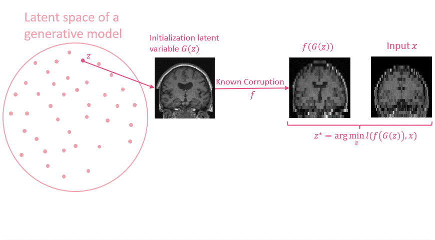

---
Implementation of paper "InverseSR: 3D Brain MRI Super-Resolution Using a Latent Diffusion Model" of Jueqi Wang, Jacob Levman, Walter Hugo Lopes Pinaya, Petru-Daniel Tudosiu, M. Jorge Cardoso and Razvan Marinescu, in MICCAI 2023.

We have developed an unsupervised technique for MRI superresolution. We leverage a recent pre-trained Brain LDM for building powerful image priors over T1w brain MRIs. Our method is capable of being adapted to different settings of MRI SR problems at test time. Our method try to find the optimal latent representation $z^∗$ in the latent space of GAN, which could be mapped to represent the SR MRI $G(z^∗)$.

<p align="center">
     
</p>

This gif shows the image space of the gradual optimization process when InverseSR tries to find the optimal latent representation $z^∗$.
<p align="center">
     
</p>

## Install Requirements
```sh
pip install -r requirements.txt
```

## Running InverseSR
We have given an example of ground truth high-resolution MRI image `./inputs/IXI_T1_069.pth`. Commands and parameters to run **InverseSR** can be found in `job_script/InverseSR(ddim).sh` and `job_script/InverseSR(decoder).sh` file.


## Data Preparation

### !! This model needs to be run on GPU/CPUs with at least 80GB of memory
You can find the necessary files for running the code [here](https://drive.google.com/drive/folders/110l68um6gUJzECIv0AyF-4Fcw0rrQgA9?usp=drive_link)