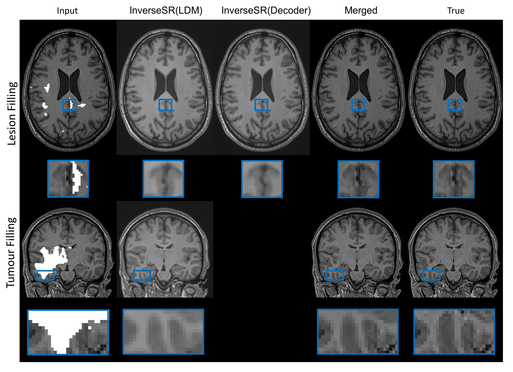

You can find the necessary files for running the code [here](https://drive.google.com/drive/folders/110l68um6gUJzECIv0AyF-4Fcw0rrQgA9?usp=drive_link)

## Lesion / Tumor Filling
Qualitative results of our approach (InverseSR) on lesion and tumour filling. Lesion and tumour masks are separately from the ISBI2015 multiple sclerosis dataset and BraTS2020.
